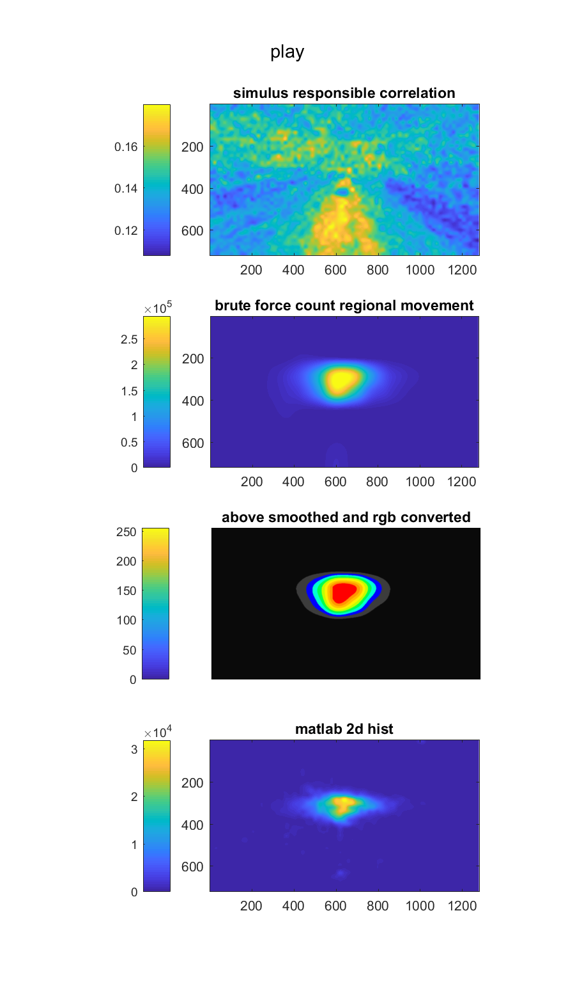
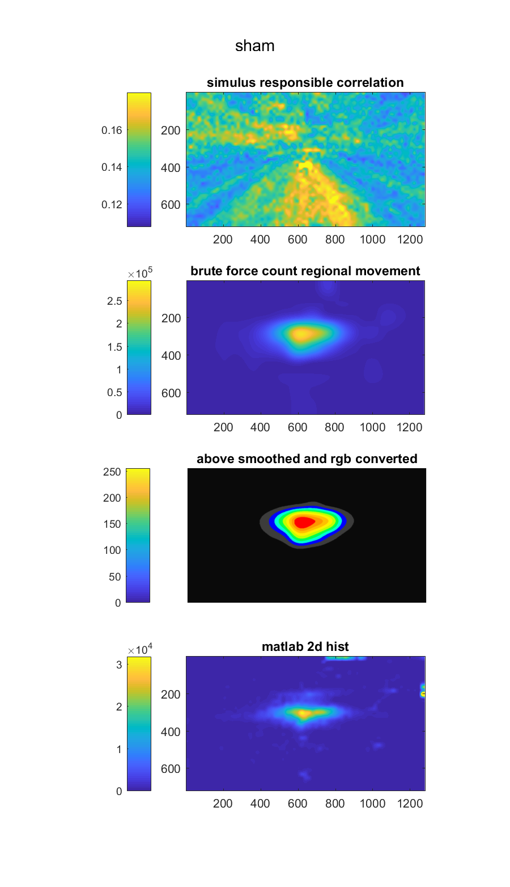
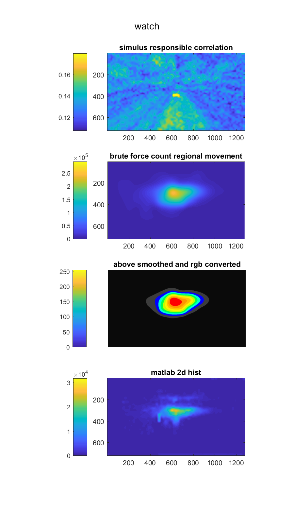

# eyetrack_analysis
eyetrack analysis toolkit for matlab.

The first version this repo containis a demo for generating a smoothed heatmap from eyetracking from supertuxkart experiment demo.

    
    
    

